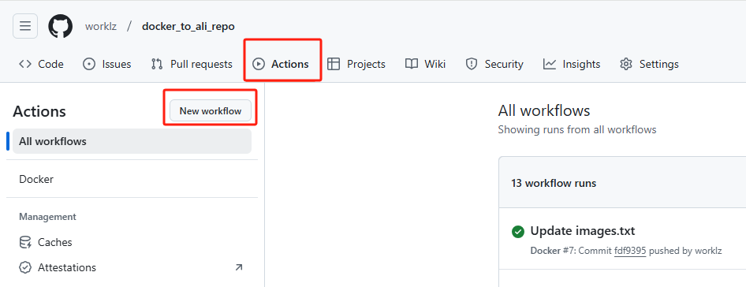
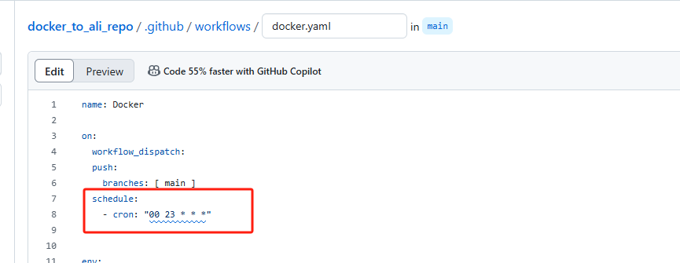
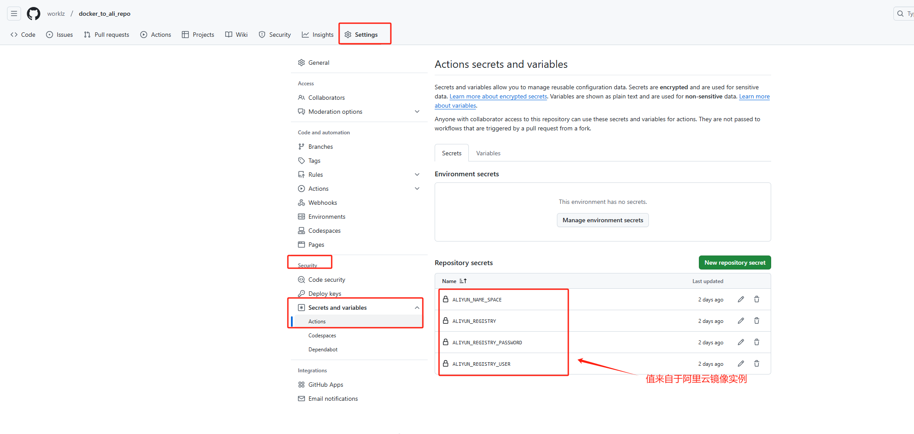
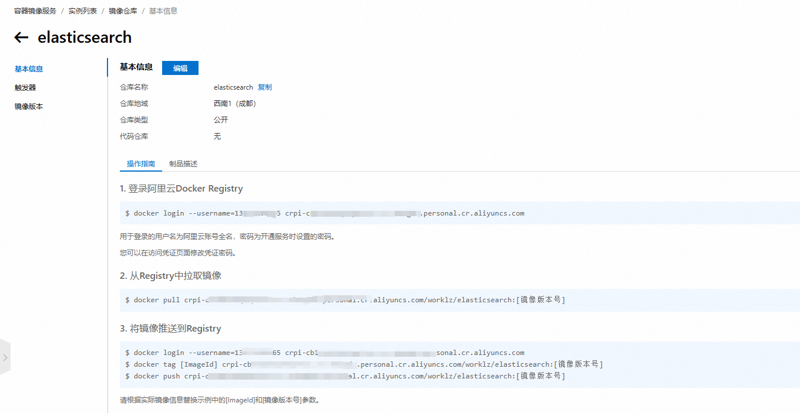

# docker_to_ali_repo

使用Github Action将Docker镜像转存到阿里云私有仓库，解决国内Docker镜像无法拉取的问题。

## 阿里云镜像实例创建/配置

进入阿里云容器镜像服务：https://cr.console.aliyun.com/cn-hangzhou/instances

### 创建个人实例


个人实例是免费的，实例创建完成后，进入实例再创建一个命名空间（后面会用于Github环境变量ALIYUN_NAME_SPACE）


查看访问凭证，获取后续Github需要配置的环境变量：
* 仓库地址（ALIYUN_REGISTRY）
* 命名空间（ALIYUN_NAME_SPACE），上一步已创建
* 用户名（ALIYUN_REGISTRY_USER)
* 密码（ALIYUN_REGISTRY_PASSWORD)


## Github仓库配置/应用

Fork本项目：[docker_to_ali_repo](https://github.com/worklz/docker_to_ali_repo)

进入Github项目，创建工作流：



配置工作流：（如果是fork本项目的此步骤省略，因为项目中已进行创建）


配置工作流内容：（如果是fork本项目的此步骤省略，因为项目中已进行创建）


如果需要定时执行工作流，在工作流内容中添加如下配置即可：



配置Github仓库环境变量（值来源于上述步骤中创建的阿里云镜像实例）：

进入Settings->Secret and variables->Actions->New Repository secret



配置要拉取的docker镜像

打开/创建Github项目根目录下的images.txt文件，配置内容如下：

* 可以加tag，也可以不用(默认latest)
* 可添加 --platform=xxxxx 的参数指定镜像架构
* 可使用 k8s.gcr.io/kube-state-metrics/kube-state-metrics 格式指定私库
* 可使用 #开头作为注释

```
elasticsearch:7.7.0
mobz/elasticsearch-head:5
kibana:7.7.0
rabbitmq:management
redis:7.4.1
# 支持私库
# k8s.gcr.io/kube-state-metrics/kube-state-metrics:v2.0.0
# xxxxx/alist:latest
# 支持指定架构
# --platform=linux/arm64 xxxxx/alist
```

images.txt文件修改提交后，自动进入Github Action构建。

也可手动构建：（此时会在Github上执行镜像拉取，然后上传到阿里云镜像容器实例中去）


等工作流执行完成后，回到阿里云镜像实例查看已拉取的镜像


## 镜像的拉取/推送

在阿里云镜像仓库中点击任意镜像，可查看镜像操作指南。(可以改成公开，拉取镜像免登录)



> 提示！使用阿里云镜像服务拉去下来的镜像名很长，可使用使用 docker tag 命令为镜像打上一个新的标签（即重命名）

```bask
拉取镜像
 docker pull crpi-xxxxxxxxxxxx.personal.cr.aliyuncs.com/worklz/elasticsearch:7.7.0
标记镜像
 docker tag crpi-xxxxxxxxxxxx.personal.cr.aliyuncs.com/worklz/elasticsearch:7.7.0 elasticsearch:7.7.0
```